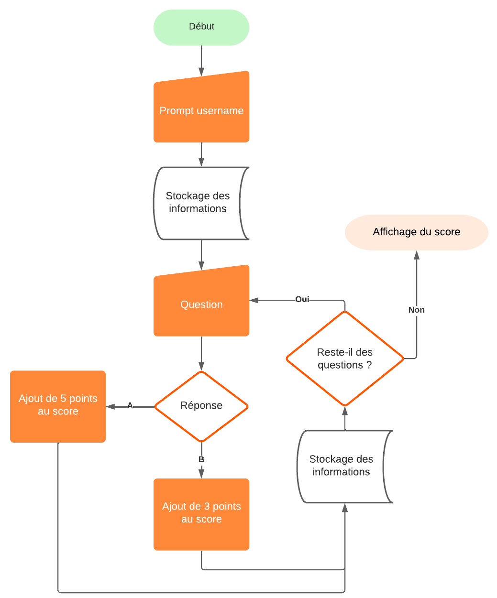

# EcoGame

Pour mes étudiant(s). Jeu d'apprentissage de JavaScript

---

 

Concevez un Text Game en JavaScript avec les notions que vous avez apprises jusqu'à présent.

Voici l'algorithme de base du jeu :

## Objectifs et attentes

- [ ] Concevoir un jeu en Vanilla JavaScript
- [ ] Le code est fonctionnel et s'exécute dans la console du navigateur sans erreur
- [ ] Stocker les données avec l'API localStorage
- [ ] Le nombre de questions minimum est de 5
- [ ] Chaque réponse donne droit à un nombre de point en fonction de la meilleure option écologique

## Pour aller plus loin

- [ ] Déployer le jeu sur GitHub Pages avec un index.html contenant les instructions pour jouer
- [ ] Créez des questions à plus de 2 réponses
- [ ] Créer une base de données avec un fichier JSON pour stocker les questions et les réponses et les exploiter dans le jeu

## Ressources

- [Documentation JavaScript](https://developer.mozilla.org/fr/docs/Web/JavaScript)
- [MDN - localStorage](https://developer.mozilla.org/fr/docs/Web/API/Window/localStorage)
